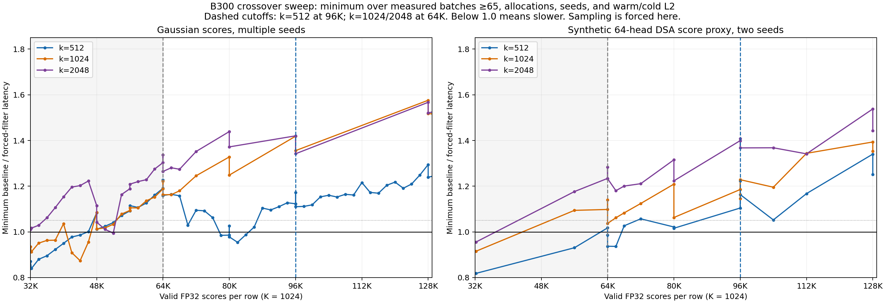

# Persistent top-k crossover sweep

B300, FP32 scores, k=512/1024/2048. The plot shows the minimum baseline / forced-sampling latency at each measured valid length across tested batches above 64 rows, allocations, seeds, and warm/cold L2. Sampling is forced to expose the transition; the final dispatcher uses the dashed cutoffs.

The complete forced-backend study covered 6,265 cases; separate final-dispatch validation covered 541 cases. All selected-value checks passed. Timings use CUPTI CUDA graphs, three trials of 40 replays per case (60 for the tile-boundary checks), with alternating backend order. Bounds and runtime measurements are B300-specific.

AI assistance was used for benchmarking and analysis.
